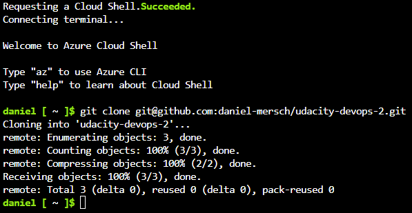
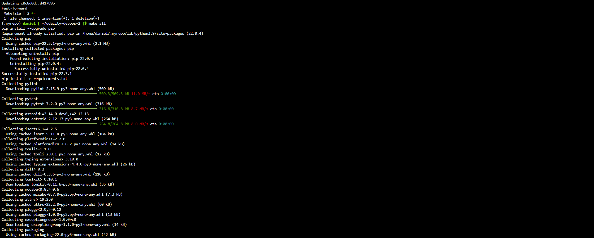
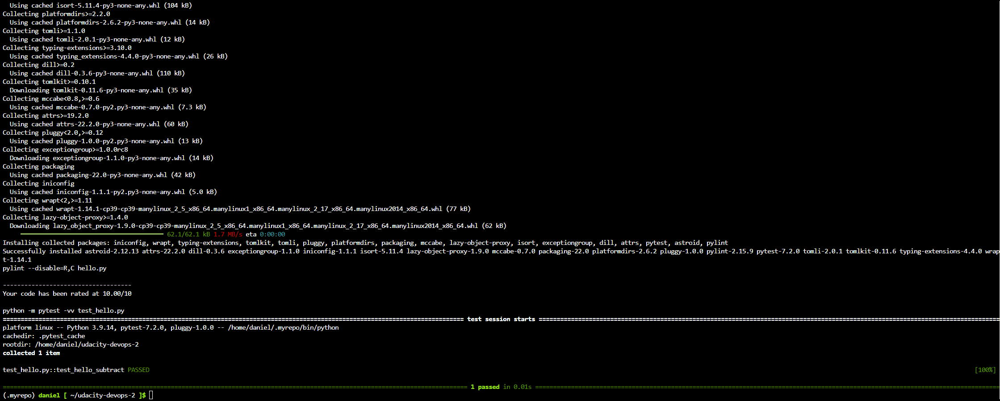
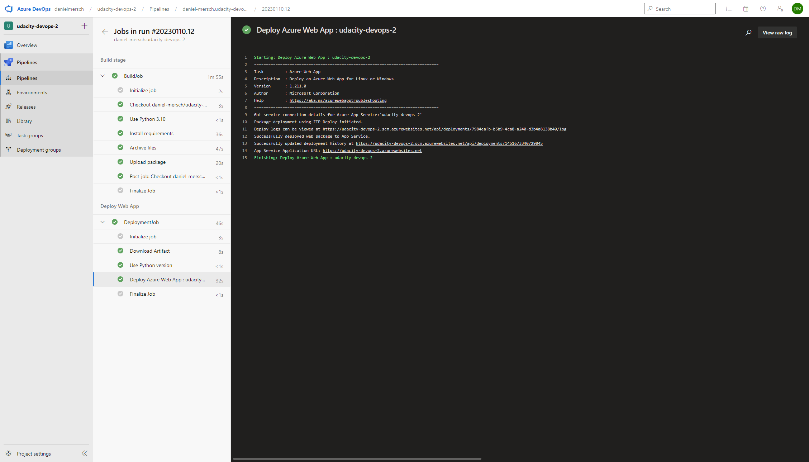
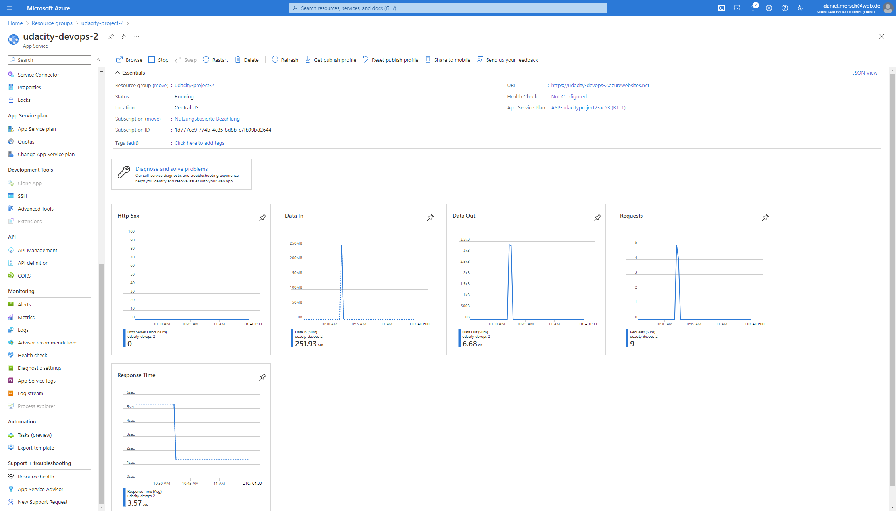
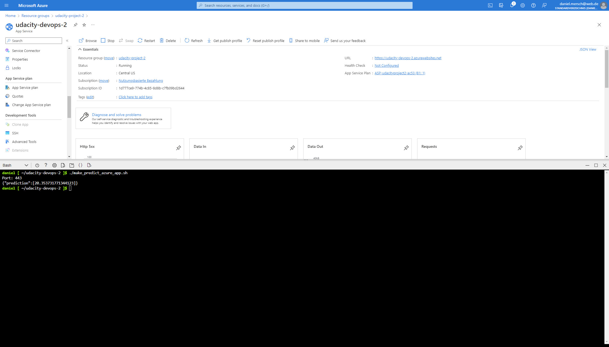
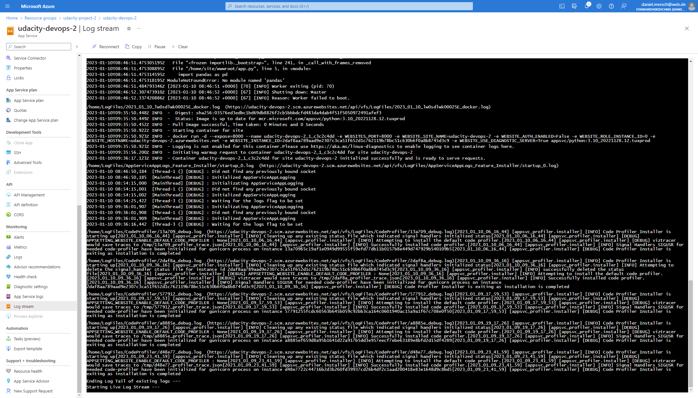
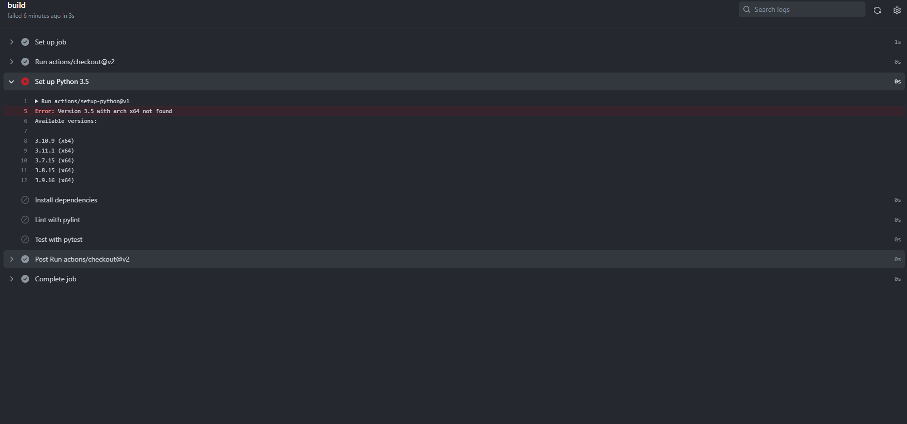
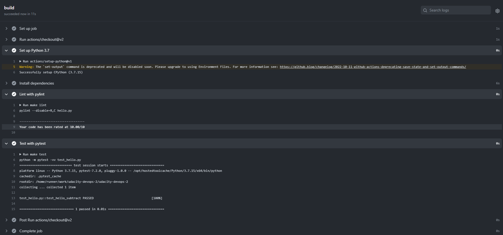

# Overview

<TODO: complete this with an overview of your project>

## Project Plan

* [Trello board](https://trello.com/invite/b/rurN4FDz/ATTIe5a5be77180e3ca007b461ef0090f41d1D789419/udacity)
* [Excel Spreadsheet](project-management-template.xlsx)

## Instructions

<TODO:  
* Architectural Diagram (Shows how key parts of the system work)>

<TODO:  Instructions for running the Python project.  How could a user with no context run this project without asking you for any help.  Include screenshots with explicit steps to create that work. Be sure to at least include the following screenshots:

* Project running on Azure App Service


* Project cloned into Azure Cloud Shell


* Passing tests that are displayed after running the `make all` command from the `Makefile`



* Output of a test run

* Successful deploy of the project in Azure Pipelines.  [Note the official documentation should be referred to and double checked as you setup CI/CD](https://docs.microsoft.com/en-us/azure/devops/pipelines/ecosystems/python-webapp?view=azure-devops).



* Running Azure App Service from Azure Pipelines automatic deployment


* Successful prediction from deployed flask app in Azure Cloud Shell.  [Use this file as a template for the deployed prediction](https://github.com/udacity/nd082-Azure-Cloud-DevOps-Starter-Code/blob/master/C2-AgileDevelopmentwithAzure/project/starter_files/flask-sklearn/make_predict_azure_app.sh).
The output should look similar to this:

```bash
udacity@Azure:~$ ./make_predict_azure_app.sh
Port: 443
{"prediction":[20.35373177134412]}
```


* Output of streamed log files from deployed application


## Enhancements

For the future we should update the application to a current python version. The used version 3.5 is no longer supported by Azure Webapp.

### Python error

Python 3.5 throws deprecated error.


Python 3.7 is the minimum supported version.


## Demo 

<TODO: Add link Screencast on YouTube>
