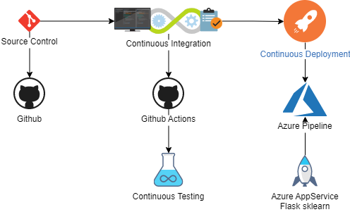
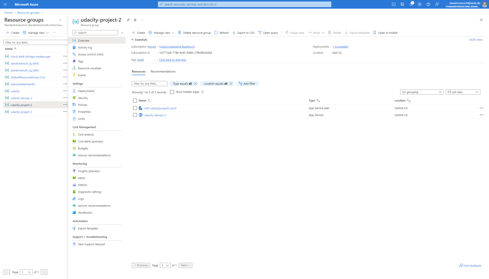
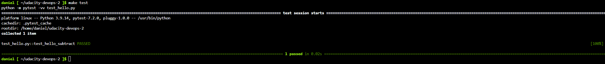

# Overview

<TODO: complete this with an overview of your project>

The goal of this project is to demonstrate the usage of a CI/CD pipeline for an Azure deployment, demonstrating code testing and automation. For a working demo we use the application `flask-sklearn`.

## Project Plan

* [Trello board](https://trello.com/invite/b/rurN4FDz/ATTIe5a5be77180e3ca007b461ef0090f41d1D789419/udacity)
* [Excel Spreadsheet](project-management-template.xlsx)

## Instructions

* Architectural Diagram (Shows how key parts of the system work)



To make this project work we have to do the follwing steps

* Resource group

First step is to create a resource group in Azure for our resources. I named it `udacity-project-2`.



* Project running on Azure App Service

Next step is the creation of a Azure AppService. The CD pipeline will deploy the python application (`flask-sklearn`) into this AppService.


* Project cloned into Azure Cloud Shell

To test the application later we clone our Github repo into Microsoft Azure CloudShell.

```bash
cd ~
git clone git@github.com:daniel-mersch/udacity-devops-2.git
cd udacity-devops-2
```


* Passing tests that are displayed after running the `make all` command from the `Makefile`

To run a python app in CloudShell we have to first install a virtual environment and install all depenfdencies. This is done by executing our Makefile.

```bash
make all
```


* Output of a test run

Now we run a test of our code.

```bash
make test
```



* Successful deploy of the project in Azure Pipelines.  [Note the official documentation should be referred to and double checked as you setup CI/CD](https://docs.microsoft.com/en-us/azure/devops/pipelines/ecosystems/python-webapp?view=azure-devops).

With each push to the Github repo the CI pipeline runs and the the CD pipeline deploys our application to Azure. This runs automatically.


* Running Azure App Service from Azure Pipelines automatic deployment

The Webapp can be accessed via webbrowser: `https://udacity-devops-2.azurewebsites.net/`


* Successful prediction from deployed flask app in Azure Cloud Shell. 

We have a little shell script called `make_predict_azure_app.sh`, which makes test call top our WebApp.

```bash
./make_predict_azure_app.sh
```


* Output of streamed log files from deployed application

Last step is to verify, that our Webapp is running like expected. Therefore we take a look at the streamed log.

[Streamed Log](https://portal.azure.com/#@danielmerschweb.onmicrosoft.com/resource/subscriptions/1d777ce9-774b-4c85-8d8b-c7fb09bd2644/resourceGroups/udacity-project-2/providers/Microsoft.Web/sites/udacity-devops-2/logStream)


## Enhancements

For the future we should update the application to a current python version. The used version 3.5 is no longer supported by Azure Webapp.

### Python error

Python 3.5 throws deprecated error.


Python 3.7 is the minimum supported version.


## Demo 

<TODO: Add link Screencast on YouTube>
